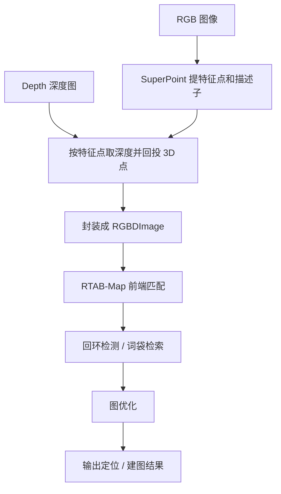
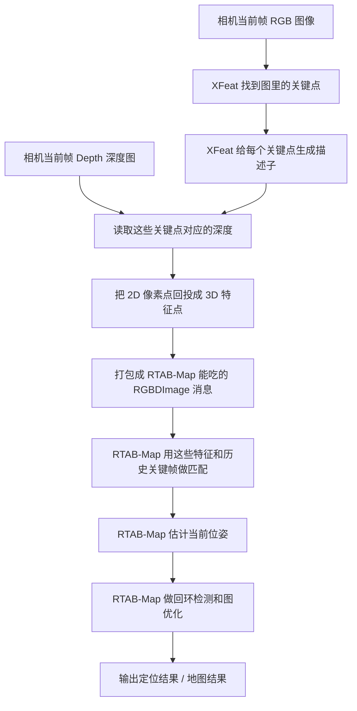
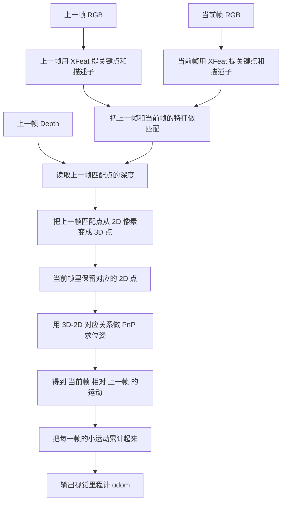
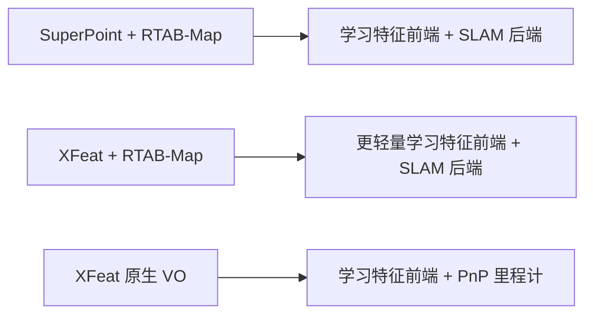

# XFeat / SuperPoint / RTAB-Map 对比

下面把当前我们聊到的三条链路放在一起，方便直接对比：

- `SuperPoint + RTAB-Map`
- `XFeat + RTAB-Map`
- `XFeat 原生 VO / 视觉里程计`

---

## 1. SuperPoint + RTAB-Map



一句话：
`SuperPoint` 负责提供视觉特征，`RTAB-Map` 负责后端定位与建图。

特点：

- 前端是学习特征
- 后端是 `RTAB-Map`
- 适合做定位、回环、建图
- 整体比纯前端 VO 更重

---

## 2. XFeat + RTAB-Map



一句话：
`XFeat` 取代 `SuperPoint` 做前端特征，后端仍然交给 `RTAB-Map`。

特点：

- 原理上和 `SuperPoint + RTAB-Map` 很像
- 只是前端网络从 `SuperPoint` 换成了 `XFeat`
- `XFeat` 更偏轻量、速度快
- 如果特征太少，`RTAB-Map` 仍然会报无法估计变换

更白话一点：

1. 相机先拍到一张彩色图。
2. `XFeat` 在这张图里找“值得跟踪的点”，比如角点、纹理点。
3. `XFeat` 再给每个点生成一个“指纹描述子”，方便后面匹配。
4. 同时查看深度图，确认这些点在三维空间里离相机有多远。
5. 这样就得到一批“带三维位置的视觉特征点”。
6. 然后把这批特征交给 `RTAB-Map`。
7. `RTAB-Map` 再去和历史图像/关键帧匹配，判断机器人现在在什么位置。

这里要注意：

- `XFeat` 在这条链路里只负责“提点 + 给描述子”
- 真正做定位、回环、建图的还是 `RTAB-Map`

---

## 3. XFeat 原生 VO



一句话：
`XFeat` 不只是提特征，而是自己完成前后帧匹配、深度回投和 `PnP`，直接输出视觉里程计。

特点：

- 这是纯前端 VO
- 不依赖 `RTAB-Map` 后端
- 轻量、直接
- 容易累计漂移
- `z / roll / pitch` 常会漂
- 更适合做辅助修正，不适合单独长期做全局定位

更白话一点：

1. 先看“上一帧”图像里有哪些特征点。
2. 再看“当前帧”图像里有哪些特征点。
3. 找出“上一帧的哪个点”和“当前帧的哪个点”其实是同一个物体上的同一个位置。
4. 因为上一帧有深度图，所以能知道上一帧这些点在三维空间里的坐标。
5. 于是就有了一组关系：
   上一帧里的 3D 点  <->  当前帧里的 2D 像素点
6. 有了这组对应关系，就能用 `PnP` 反推出：
   相机从上一帧到当前帧，究竟转了多少、平移了多少。
7. 每一帧都这样算一次，再把这些小运动连续累加起来，就得到一条视觉里程计轨迹。

这里最关键的区别是：

- 这条链路里 **没有 RTAB-Map 后端**
- `XFeat` 自己就把“前后帧运动”算出来了
- 所以它更像一个“视觉里程计传感器”

---

## 4. 三者关系总结



核心区别：

- `SuperPoint + RTAB-Map`
  前端特征是 `SuperPoint`，后端是 `RTAB-Map`
- `XFeat + RTAB-Map`
  前端特征是 `XFeat`，后端还是 `RTAB-Map`
- `XFeat 原生 VO`
  不走 `RTAB-Map`，直接前后帧匹配 + 深度 + `PnP`

---

## 5. Dashgo 当前实际逻辑

你现在 Dashgo 上跑的，不是“纯 XFeat 接管导航”，而是“双路里程分工”：

- 原始 `/odom`：负责建图、点云投影、障碍物栅格更新
- `XFeat` 输出 `/xfeat/odom`：负责提供视觉里程计观测
- 融合节点输出 `/localized_odom`：只给路径跟踪控制使用

这样做的目的很直接：

- 地图层保持稳定，不跟着视觉修正来回扭
- 控制层还能吃到一点视觉修正，减轻底盘里程计累计误差
- 避免 Voronoi 因为地图层抖动而频繁重规划

### 5.1 Dashgo 融合版流程图

```mermaid
flowchart TD
    A[底盘编码器 / 原始 /odom] --> B[作为主里程计]

    C[RGB 图像] --> D[XFeat 提特征]
    E[Depth 深度图] --> F[给匹配点提供深度]
    D --> G[前后帧特征匹配]
    F --> H[把上一帧匹配点回投成 3D]
    G --> H
    H --> I[PnP 求相机相对运动]
    I --> J[累计成 /xfeat/odom]

    B --> K[odom_fusion_node]
    J --> K
    K --> L[/localized_odom]

    B --> M[点云投影到 map]
    B --> N[栅格地图 / combined_grid 更新]
    B --> O[Voronoi 地图输入]

    L --> P[路径跟踪 / start_nav]
    O --> P
```

### 5.2 更白话一点

1. 底盘自己的 `/odom` 还是主数据源。
2. 激光点云投影到 `map`、障碍物栅格更新、Voronoi 骨架生成，仍然全部跟着原始 `/odom` 走。
3. `XFeat` 这边单独用 RGB-D 做视觉里程计，输出 `/xfeat/odom`。
4. `odom_fusion_node` 用“原始 `/odom` 为主，`XFeat` 轻量修正”的方式，输出 `/localized_odom`。
5. 真正发速度控制的路径跟踪节点，使用的是 `/localized_odom`。
6. 结果就是：
   - 地图不跟着视觉修正一起扭
   - 机器人控制还能吃到视觉修正
   - RViz 里应该表现为“地图固定，机器人在地图上移动”

### 5.3 为什么之前会看起来像地图在转

因为之前把融合后的 `/localized_odom`` 同时喂给了：

- 点云投影
- 栅格更新
- 路径跟踪

这样一来，只要 `XFeat` 对姿态有一点修正：

- 投影到 `map` 的点云会跟着变
- `combined_grid` 会跟着变
- Voronoi 骨架也会跟着变

在 RViz 里看起来就像“机器人没怎么动，地图在转”。

本质上不是 RViz 把地图转了，而是你送进地图层的位姿本身在被视觉修正不断改写。

---

## 6. 对你当前项目的含义

在你现在的 Dashgo 和 Auto Nav 两边，最实用的理解是：

- `RTAB-Map` 版：
  更像“定位/建图系统”
- `XFeat 原生 VO` 版：
  更像“视觉里程计传感器”
- `Dashgo 融合版`：
  更像“底盘里程计主导 + 视觉里程计辅助修正”的工程化实现

所以：

- 如果目标是建图、回环、全局定位：
  选 `SuperPoint + RTAB-Map` 或 `XFeat + RTAB-Map`
- 如果目标是做视觉辅助里程计：
  选 `XFeat 原生 VO`
- 如果目标是“底盘 /odom 为主，视觉做辅助修正”：
  现在 Dashgo 这套融合模式就是这个方向

---

## 7. XFeat 这次做了哪些优化

这一轮真正有效的优化，不是继续让 `XFeat` 维护自己的长期全局 pose，而是把它改成“短时局部增量修正源”。

### 7.1 核心思路变化

之前的思路：

- `XFeat` 自己累计 `/xfeat/odom`
- 再拿这个绝对位姿去拉 `/odom`

这个思路的问题是：

- 只要中间有一次 `PnP` 跳变
- 后面的累计轨迹就都建立在错误基准上
- 即使后面看起来平滑，也是在错轨迹上继续平滑

现在的思路：

- `XFeat` 仍然算前后帧相对运动
- 但只输出本帧局部增量 `/xfeat/delta_odom`
- 融合节点拿 `/odom` 的本帧增量和 `XFeat` 的本帧增量做比较
- 正常就轻量采用
- 异常就直接丢弃

一句话：

- 不再信 `XFeat` 的长期全局累计
- 只信它这一小步有没有参考价值

### 7.2 现在的增量融合流程

```mermaid
flowchart TD
    A[底盘 /odom 上一时刻] --> B[算出本帧 base 增量]
    C[XFeat 前后帧匹配 + Depth + PnP] --> D[算出本帧 xfeat 增量]
    B --> E[比较两者增量差异]
    D --> E
    E --> F{是否在阈值内}
    F -- 是 --> G[按 gain 轻量融合]
    F -- 否 --> H[丢弃 XFeat 本帧增量]
    G --> I[/localized_odom]
    H --> I
```

### 7.3 具体优化点

- `XFeat` 新增 `/xfeat/delta_odom`
  不再只看 `/xfeat/odom`
- 融合节点改成比较局部增量
  比较的是 `dx / dy / dyaw`
- 增加异常值剔除
  用平移差阈值和偏航差阈值判断是否拒绝本帧
- 保留 `/odom` 为主
  `XFeat` 只做小比例修正，不直接接管控制
- 日志只在导航时打印
  不在空闲状态刷屏
- CSV 导出
  方便离线看每一步到底是 `base_only`、`fused` 还是 `rejected`

### 7.4 三种融合状态是什么意思

- `base_only`
  这一步没有使用 `XFeat`
  常见原因是超时、没新结果、或没有有效观测
- `fused`
  这一步使用了 `XFeat` 增量修正
- `rejected`
  `XFeat` 这一帧虽然给出了结果，但和 `/odom` 差得太大，所以被丢弃

### 7.5 为什么这种方式比绝对位姿融合更稳

因为它把错误限制在“这一小步”：

- 这一帧错了，就丢这一帧
- 不会把整条后续轨迹基准一起带坏

而绝对位姿融合的问题是：

- 一次跳变进入累计轨迹后
- 后面所有帧都继承这个错误基准

所以对地面机器人来说：

- `XFeat` 更适合做局部运动建议
- 不适合直接当长期全局定位源

### 7.6 仿真和真实机的一个关键区别

仿真里：

- 相机 frame 和机器人 TF 树通常天然连通
- 更容易直接把视觉结果映射到底盘坐标

真实机里：

- D435 是单独驱动起来的
- 相机树、底盘树、安装外参不一定天然连通
- 所以真实机更容易遇到：
  - optical frame 不一致
  - `camera_link` / `camera_color_optical_frame` 对不上
  - TF 断树
  - 同一个 child frame 被多路 TF 抢发

因此真实机比仿真更需要：

- 保守融合
- 明确的 TF 基线
- 不让 `XFeat` 直接发布和底盘冲突的 TF

### 7.7 这轮优化后的工程结论

- `XFeat + RTAB-Map`
  适合做有后端约束的定位/建图
- `XFeat 原生 VO`
  适合做视觉运动观测
- `XFeat 增量融合 /odom`
  更适合你现在这种“底盘里程计主、视觉辅助修正”的导航方案
